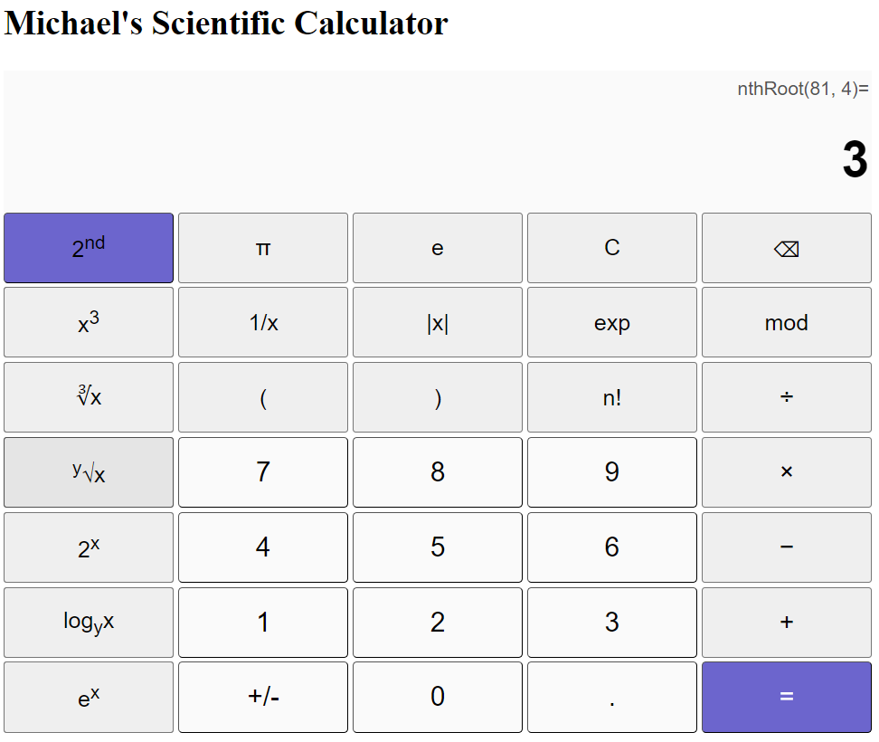

# Webpage Scientific Calculator

Welcome to my webpage scientific calculator！ The calculator is built with complete frontend tech! It is composed of using the raw HTML, raw CSS, and vanilla JavaScript, no JS frontend frameworks/tools nor third-party CSS libraries used. The appearance and layout of the calculator resembles to the Windows 10 built-in scientific calculator. Operating the calculator and functionalities that this calculator supports also resembles the ones of Windows 10 built-in calculator. The Grid Layout is adopted in this calculator to strictly control the positions and alignments of buttons, labels, and the input boxes. The calculator features a 2nd-function button to toggle on/off the second function mode.

The core algorithms in the calculator.js script are:
- A group of user-defined JS functions to correctly handle and parse operands, operators, and the order of arithmetic operations from the user-input mathematical expression 
- A pair of user-defined JS functions to activate and deactivate 2nd function button, clicking on which will toggle the hide/show mode of the two sets of overlayed buttons in the leftmost column, thereby enabling users to use the other set of functions
- The standard JS API eval() method to carry out the final calculation of parsed user-input mathematical expression.

# Demos of different mathematical operations

## 2ndFunc Mode OFF

### Basic four mixed operation
.png)

### Reciprocal operation
.png)

### Absolute value operation
.png)

### Square root operation
.png)

### Square operation
.png)

### Scientific notation
.png)

### PI constant
.png)

### Natural constant e
.png)

### Modulo operation
.png)

### Factorial operation
.png)

### Exponentiation operation with base x and exponent y
.png)

### Power of base 10 operation
.png)

### Common logrithm operation
.png)

### Natural logrithm operation
.png)

## 2ndFunc Mode ON

### Cube operation
.png)

### Cube root operation
.png)

### Nth(Any number) root operation

### Exponentiation operation with base 2
.png)

### Logrithmic operation with base N(any number)
.png)

### Exponentiation operation with base natural constant e
.png)
